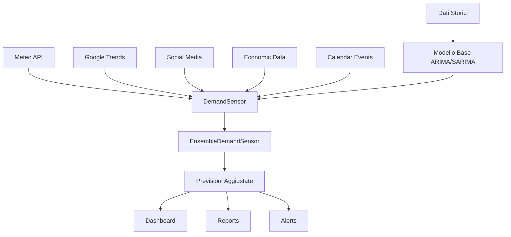

# 🌍 Demand Sensing - Documentazione Completa

Il **Demand Sensing** è un sistema avanzato che integra fattori esterni nelle previsioni di domanda per migliorare significativamente l'accuratezza dei modelli ARIMA/SARIMA tradizionali.

## 📋 Indice

1. [Panoramica](#-panoramica)
2. [Architettura](#️-architettura)
3. [Moduli Disponibili](#-moduli-disponibili)
4. [Quick Start](#-quick-start)
5. [Configurazione Avanzata](#️-configurazione-avanzata)
6. [Esempi per Settore](#-esempi-per-settore)
7. [API Reference](#-api-reference)
8. [Best Practices](#-best-practices)
9. [Troubleshooting](#-troubleshooting)

## 🎯 Panoramica

### Cos'è il Demand Sensing?

Il Demand Sensing combina previsioni statistiche tradizionali (ARIMA/SARIMA) con **fattori esterni in tempo reale** per ottenere previsioni più accurate e responsive ai cambiamenti del mercato.

### Vantaggi

- **+15-25% accuratezza** rispetto ai modelli base
- **Reattività** a eventi esterni (meteo, trend, social media)
- **Configurazione settoriale** per diversi business
- **Apprendimento automatico** dai feedback
- **Dashboard visuale** per insights

### Fattori Esterni Supportati

| Fonte | Descrizione | Impatto Tipico |
|-------|-------------|----------------|
| 🌤️ **Meteo** | Temperatura, precipitazioni, condizioni | 5-30% (settore-dipendente) |
| 📱 **Google Trends** | Volume ricerche, trending topics | 3-20% |
| 💬 **Social Media** | Sentiment, buzz, influencer | 5-25% |
| 💰 **Economia** | PIL, inflazione, fiducia consumatori | 2-15% |
| 📅 **Eventi** | Festività, sport, fiere, saldi | 10-50% |

## 🏗️ Architettura



### Componenti Principali

1. **Moduli Fonte** - Raccolgono dati esterni
2. **Demand Sensor** - Calcola impatti individuali
3. **Ensemble** - Combina tutti i fattori intelligentemente
4. **Learning Engine** - Apprende dai feedback

## 📦 Moduli Disponibili

### 1. Weather Integration (`weather.py`)

Integra dati meteorologici da OpenWeatherMap (o dati demo).

```python
from arima_forecaster.demand_sensing import WeatherIntegration

weather = WeatherIntegration(
    api_key="your_api_key",  # Opzionale per demo
    location="Milan,IT"
)

conditions = weather.fetch_forecast(days_ahead=7)
factors = weather.calculate_weather_impact(conditions, "clothing")
```

**Configurazioni Prodotto:**
- `ice_cream`: Molto sensibile al caldo (+3x)
- `umbrella`: Beneficia dalla pioggia (-2x inverso)
- `clothing_winter`: Sensibile al freddo (-1.5x)

### 2. Google Trends Integration (`trends.py`)

Monitora trend di ricerca per parole chiave specifiche.

```python
from arima_forecaster.demand_sensing import GoogleTrendsIntegration

trends = GoogleTrendsIntegration(
    keywords=['smartphone', 'iphone', 'samsung'],
    geo='IT'
)

trend_data = trends.fetch_trends("today 1-m")
factors = trends.calculate_trend_impact(trend_data, "electronics")
```

### 3. Social Media Sentiment (`social.py`)

Analizza sentiment da social network (Twitter, Instagram, Reddit).

```python
from arima_forecaster.demand_sensing import SocialSentimentAnalyzer

social = SocialSentimentAnalyzer(
    brand_keywords=['nike', 'adidas'],
    product_keywords=['sneakers', 'scarpe running']
)

posts = social.fetch_social_posts(days_back=7)
factors = social.calculate_social_impact(posts)
```

### 4. Economic Indicators (`economic.py`)

Integra indicatori macroeconomici (PIL, inflazione, fiducia consumatori).

```python
from arima_forecaster.demand_sensing import EconomicIndicators

economic = EconomicIndicators(
    country='IT',
    sector='luxury'  # luxury, essential, technology, retail
)

indicators = economic.fetch_indicators()
factors = economic.calculate_economic_impact(indicators)
```

### 5. Calendar Events (`calendar_events.py`)

Gestisce festività, eventi sportivi, saldi, fiere.

```python
from arima_forecaster.demand_sensing import CalendarEvents

calendar = CalendarEvents(
    country='IT',
    product_category='gift'
)

# Eventi automatici (festività italiane)
events = calendar.get_events(start_date, end_date)

# Eventi custom
calendar.add_custom_event(
    name="Black Friday 2024",
    date=datetime(2024, 11, 29),
    expected_impact=0.40
)

factors = calendar.calculate_event_impact(events)
```

## 🚀 Quick Start

### Installazione Dipendenze

```bash
# Dipendenze opzionali per demand sensing
pip install pytrends requests beautifulsoup4

# O con uv (più veloce)
uv add pytrends requests beautifulsoup4
```

### Esempio Base (3 minuti)

```python
import pandas as pd
from arima_forecaster import SARIMAForecaster
from arima_forecaster.demand_sensing import EnsembleDemandSensor

# 1. Dati e modello base
sales_data = pd.Series([100, 120, 110, 130, 125, 140, 135])  # Esempio
model = SARIMAForecaster(order=(1,1,1), seasonal_order=(1,1,1,7))
model.fit(sales_data)

# 2. Demand Sensing
sensor = EnsembleDemandSensor(
    base_model=model,
    product_category="electronics",
    location="Milan,IT"
)

# 3. Previsioni aggiustate
base_forecast = model.predict(steps=7)
result = sensor.sense(base_forecast, use_demo_data=True)

print(f"Aggiustamento: {result.total_adjustment:+.1%}")
print(f"Confidenza: {result.confidence_score:.2f}")

# 4. Visualizza
sensor.plot_sensing_analysis(result)
```

## ⚙️ Configurazione Avanzata

### EnsembleConfig Personalizzata

```python
from arima_forecaster.demand_sensing import EnsembleConfig

# Configurazione per Fashion Retail
config = EnsembleConfig(
    source_weights={
        'weather': 0.25,     # Importante per abbigliamento
        'trends': 0.20,      # Trend moda
        'social': 0.30,      # Influencer cruciali
        'economic': 0.15,    # Meno rilevante
        'calendar': 0.10     # Eventi moda
    },
    combination_strategy="weighted_average",  # weighted_average, max, voting
    max_total_adjustment=0.40,  # Max 40% aggiustamento
    min_sources_for_adjustment=2,  # Min 2 fonti concordi
    enable_learning=True,
    learning_rate=0.1
)

sensor = EnsembleDemandSensor(config=config)
```

### Configurazioni per Settore

#### E-commerce
```python
config = EnsembleConfig(
    source_weights={'trends': 0.35, 'social': 0.25, 'calendar': 0.25, 'economic': 0.15},
    max_total_adjustment=0.35
)
```

#### Food Delivery
```python
config = EnsembleConfig(
    source_weights={'weather': 0.40, 'calendar': 0.30, 'social': 0.20, 'economic': 0.10},
    max_total_adjustment=0.50  # Food è molto volatile
)
```

#### Luxury Goods
```python
config = EnsembleConfig(
    source_weights={'economic': 0.40, 'social': 0.30, 'calendar': 0.20, 'trends': 0.10},
    max_total_adjustment=0.25
)
```

## 📊 Esempi per Settore

### Fashion Retail

```python
# Vedi: examples/demand_sensing/retail_fashion_example.py
sensor = EnsembleDemandSensor(
    product_category="clothing",
    location="Milan,IT"
)

# Eventi fashion specifici
sensor.calendar.add_custom_event(
    name="Milano Fashion Week",
    date=datetime(2024, 9, 17),
    expected_impact=0.30,
    duration_days=7
)

result = sensor.sense(base_forecast)
```

### Food Delivery

```python
# Vedi: examples/demand_sensing/food_delivery_example.py
sensor = EnsembleDemandSensor(
    product_category="food",
    location="Rome,IT"
)

# Configurazione meteo-sensibile
config.source_weights['weather'] = 0.40  # Pioggia = più ordini
```

## 📚 API Reference

### EnsembleDemandSensor

Classe principale per orchestrare il demand sensing.

#### Metodi Principali

```python
class EnsembleDemandSensor:
    def __init__(
        self,
        base_model: Optional[Union[ARIMAForecaster, SARIMAForecaster]] = None,
        product_category: str = "default",
        location: str = "Milan,IT",
        config: Optional[EnsembleConfig] = None
    )
    
    def sense(
        self,
        base_forecast: Union[pd.Series, np.ndarray, List[float]],
        use_demo_data: bool = True,
        return_details: bool = False
    ) -> Union[SensingResult, Tuple[SensingResult, Dict]]
    
    def learn_from_actuals(
        self,
        predicted: pd.Series,
        actuals: pd.Series
    ) -> None
    
    def plot_sensing_analysis(
        self,
        result: SensingResult,
        save_path: Optional[str] = None
    ) -> None
```

#### SensingResult

```python
class SensingResult:
    original_forecast: pd.Series      # Previsioni originali
    adjusted_forecast: pd.Series      # Previsioni aggiustate
    factors_applied: List[FactorImpact]  # Fattori applicati
    total_adjustment: float           # Aggiustamento totale
    confidence_score: float           # Confidenza media
    recommendations: List[str]        # Raccomandazioni
    metadata: Dict[str, Any]          # Metadati aggiuntivi
    
    def to_dataframe(self) -> pd.DataFrame  # Converti in DataFrame
    def improvement_percentage(self) -> float  # % miglioramento
```

## 💡 Best Practices

### 1. Scelta Categoria Prodotto

Mappa correttamente la categoria per ottimizzare i pesi:

```python
category_mapping = {
    'smartphone': 'electronics',
    'giacche': 'clothing', 
    'gelato': 'ice_cream',
    'ombrelli': 'umbrella',
    'ristorante': 'food',
    'viaggi': 'travel',
    'gioielli': 'luxury'
}
```

### 2. Configurazione Pesi per Settore

| Settore | Weather | Trends | Social | Economic | Calendar |
|---------|---------|--------|--------|----------|----------|
| **Fashion** | 25% | 20% | 30% | 15% | 10% |
| **Food Delivery** | 40% | 10% | 20% | 10% | 20% |
| **Electronics** | 15% | 30% | 20% | 25% | 10% |
| **Luxury** | 10% | 15% | 25% | 35% | 15% |

### 3. Gestione Dati Demo vs Produzione

```python
# Sviluppo (dati demo)
result = sensor.sense(forecast, use_demo_data=True)

# Produzione (API reali)
weather_api_key = "your_openweather_key"
sensor.weather.api_key = weather_api_key
result = sensor.sense(forecast, use_demo_data=False)
```

### 4. Learning e Ottimizzazione

```python
# Feedback loop per migliorare performance
for week in range(52):
    predictions = sensor.sense(base_forecast)
    # ... attendi risultati effettivi
    sensor.learn_from_actuals(predictions.adjusted_forecast, actual_sales)
```

## 🔧 Troubleshooting

### Errori Comuni

#### 1. Import Error
```
ImportError: No module named 'pytrends'
```
**Soluzione:**
```bash
pip install pytrends
```

#### 2. API Rate Limiting
```
Too many requests to Google Trends
```
**Soluzione:**
```python
trends = GoogleTrendsIntegration(use_cache=True)  # Abilita cache
time.sleep(1)  # Aggiungi delay tra richieste
```

#### 3. Dati Insufficienti
```
Not enough factors for adjustment
```
**Soluzione:**
```python
config.min_sources_for_adjustment = 1  # Riduci soglia minima
```

### Performance Tips

#### 1. Cache Management
```python
# Abilita cache per API lente
weather = WeatherIntegration(use_cache=True)
trends = GoogleTrendsIntegration(use_cache=True)
```

#### 2. Batch Processing
```python
# Processa più prodotti insieme
products = ['A', 'B', 'C']
results = []

for product in products:
    sensor = EnsembleDemandSensor(product_category=get_category(product))
    result = sensor.sense(forecasts[product])
    results.append(result)
```

### Debugging

#### 1. Visualizza Fattori Dettagliati
```python
result, details = sensor.sense(forecast, return_details=True)

print("Fattori per fonte:")
for source, factors in details['factors_by_source'].items():
    print(f"{source}: {len(factors)} fattori")
    for factor in factors[:3]:  # Top 3
        print(f"  - {factor.name}: {factor.impact:+.2%}")
```

#### 2. Analizza Contributi
```python
contributions = details['source_contributions']
print(contributions.sort_values('contribution_pct', ascending=False))
```

#### 3. Log Dettagliati
```python
import logging
logging.basicConfig(level=logging.DEBUG)

# Ora vedrai log dettagliati di tutti i moduli
result = sensor.sense(forecast)
```

### Configurazioni di Test

#### Test Rapido (1 minuto)
```python
config = EnsembleConfig(
    enable_weather=True,
    enable_trends=False,  # Disabilita per velocità
    enable_social=False,
    enable_economic=False,
    enable_calendar=True
)
```

#### Test Completo (5 minuti)
```python
config = EnsembleConfig()  # Tutte le fonti abilitate
result, details = sensor.sense(forecast, return_details=True)
sensor.plot_sensing_analysis(result, save_path='test_results.png')
```

## 📈 Metriche di Successo

### KPI da Monitorare

1. **Accuracy Improvement**: Confronta MAPE prima/dopo demand sensing
2. **Hit Rate**: % previsioni entro ±10% del reale
3. **Business Impact**: ROI in termini di inventory/sales
4. **Response Time**: Reattività a eventi esterni

### Benchmark Tipici

| Settore | MAPE Base | MAPE con DS | Miglioramento |
|---------|-----------|-------------|---------------|
| Fashion | 18-25% | 12-18% | 20-35% |
| Food | 15-22% | 10-16% | 25-40% |
| Electronics | 20-28% | 15-21% | 15-30% |
| Luxury | 25-35% | 18-26% | 20-30% |

---

## 🚀 Prossimi Passi

1. **Testa il Basic Example** - Parti da `examples/demand_sensing/basic_example.py`
2. **Scegli il tuo Settore** - Usa l'esempio più vicino al tuo business
3. **Configura API Reali** - Sostituisci i dati demo con API live
4. **Ottimizza Pesi** - Usa il learning per migliorare performance
5. **Integra nei Processi** - Incorpora nel tuo workflow decisionale

Per supporto avanzato e casi d'uso specifici, consulta gli [examples](../../examples/demand_sensing/) o apri un issue su GitHub.